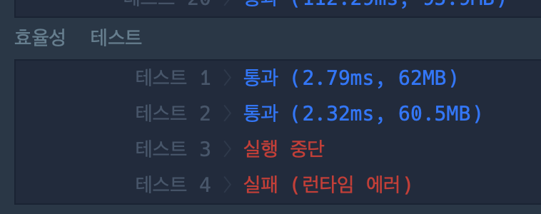

#  0428 전화번호 목록
## 풀이
접두어인 경우 -> false
접두어가 없는 경우 -> true

접두어가 특정되지 않았으므로, 재귀적으로 구현
비교 로직?
- Num1 의 길이를 잰 다음, charAt 012.. 길이만큼 for문 함수 내부 배열에 저장하여 비교

### 풀이 1
```java
import java.util.*;

class Solution {
    public boolean solution(String[] phone_book) {
    boolean a = true;
    for(int i = 0; i < phone_book.length; i++) {
        a = isHead(phone_book, i, 0);
        if(!a) break;
    }
    return a;


    }
    static boolean isHead(String[] phone_book,int index1, int index2) {

        String phoneNum1 = phone_book[index1];
        String phoneNum2 = phone_book[index2];

        int i = 0;

        if(phoneNum1.length() > phoneNum2.length()) return isHead(phone_book, index1, ++index2);

        for(i=0; i<phoneNum1.length(); i++) {
            if(phoneNum1.charAt(i) != phoneNum2.charAt(i)) break;
        }
        if(i == phoneNum1.length()) return false;
        else return true;

    }

}
```
문제점 1. 자기 자신과의 비교를 하게 된다. index1 == index 2인 경우가 무조건 있기 때문에 해당 코드는 어떤 Input이던 false를 return함.

문제점 2. BaseCase가 없음. -> Index2가 phone_book[] 인덱스 하나 바깥까지 결국 접근한다. 

문제점 3. phone_book[1,000,000] -> StackOverFlow 

문제점 4. 이중 반복문 형태로 완전탐색을 해도, 100만개의 요소들을 다 검사하기에는 시간이 부족함. 

### 풀이 2
```java
import java.util.*;

class Solution {
    public boolean solution(String[] phone_book) {
    boolean a = true;
    for(int i = 0; i < phone_book.length; i++) {
        a = isHead(phone_book, i, 0);
        if(!a) break;
    }
    return a;


    }
    static boolean isHead(String[] phone_book,int index1, int index2) {
        if(index2 == phone_book.length) return true;
        if(index1 == index2) return isHead(phone_book, index1, index2 + 1);

        String phoneNum1 = phone_book[index1];
        String phoneNum2 = phone_book[index2];


        if(phoneNum1.length() > phoneNum2.length()) return isHead(phone_book, index1, ++index2);

        int i = 0;
        for(i=0; i<phoneNum1.length(); i++) {
            if(phoneNum1.charAt(i) != phoneNum2.charAt(i)) break;
        }
        if(i == phoneNum1.length()) return false;
        else return isHead(phone_book, index1, ++index2);

    }

}
```
if문으로 간단하게 문제점 1,2는 고칠 수 있는데 로직 구조적으로 3,4는 고칠 수 없음. 

## 생각해볼 점

- startWith() 메서드 
    - String 내장 메서드. 해당 문자열이 특정 문자열로 시작하는가? 
    - "1234".startWith("123") -> return true;
    - **매개변수의 길이가 더 긴 경우에 자동으로 False를 리턴한다. OutOfBound 문제 해결**

- contain() 메서드 
    - Collection 자료구조 내장 메서드
    - 해당 자료구조(HashSet, ArrayList ..) 에 괄호 안의 값이 포함되어 있는지? -> O(N)

- substring() 메서드 
    - 문자열의 일부를 잘라서 추출


## 개선할 점(코드)

1. Sort 내장함수 사용
사전순으로 정리 이후 startWith() 함수 사용
```java
import java.util.Arrays;

class Solution {
    public boolean solution(String[] phone_book) {
        // 1. 배열을 사전순으로 정렬한다.
        Arrays.sort(phone_book);

        // 2. 내 바로 뒤의 문자열이 나와 겹치는지만 확인한다.
        for(int i = 0; i < phone_book.length - 1; i++) {
            // startsWith를 사용하면 charAt으로 일일이 비교할 필요가 없습니다.
            if(phone_book[i + 1].startsWith(phone_book[i])) {
                return false;
            }
        }
        return true;
    }
}
```

2. Hash 활용하기(출제의도)
```java
import java.util.HashSet;

class Solution {
    public boolean solution(String[] phone_book) {
        HashSet<String> set = new HashSet<>();
        
        // 1. 모든 전화번호를 HashSet에 넣는다.
        for(String num : phone_book) {
            set.add(num);
        }
        
        // 2. 각 전화번호의 부분 문자열(접두어)이 Set에 있는지 확인한다.
        for(String num : phone_book) {
            for(int j = 1; j < num.length(); j++) {
                if(set.contains(num.substring(0, j))) {
                    return false;
                }
            }
        }
        return true;
    }
}
```
hashset을 하나 더 만들어서, for문으로 배열 돌면서, Set에 있는 모든 요소들하고 비교(이중For문)

-> Set에 있는 모든 요소들하고 비교하는거? ㄴ: contain 내장함수. 

## 성능
풀이 1의 경우, 정렬하는데 O(NlogN), for문 한번 도니까 O(N) -> O(NlogN)

풀이 2의 경우, Set에 집어넣을때 O(N)
 + 
 배열 순회하면서 cotain으로 검색 근데 검색하는데 O(1)이니까 결국 O(N)

 내가 쓴건 O(N^2)
 
 결국 런타임 에러 뜬다. 